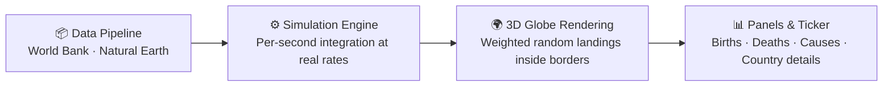

<div align="center">


# The Global Pulse

**The pulse of the global population — real borders · real data · a 3D living Earth simulated in real time**

[](https://mocas-12.github.io/The-Global-Pulse/)
[](https://react.dev)
[](https://vite.dev)
[](https://threejs.org)
[](https://data.worldbank.org/)
[](https://www.naturalearthdata.com/)

**[🌐 Live Preview (GitHub Pages)](https://mocas-12.github.io/The-Global-Pulse/)**

**English** | [简体中文](./README.zh-CN.md)

*Open the page → watch the pulse of the Earth rise and fall → click any country for real-time details*

</div>

---

> All things pass; all things begin.

## 📖 Table of Contents

- [Features](#-features)
- [UI Design](#-ui-design)
- [How It Works](#-how-it-works)
- [Project Structure](#-project-structure)
- [Quick Start](#-quick-start)
- [Data & Methodology](#-data--methodology)
- [FAQ](#-faq)
- [Data Sources](#-data-sources)
- [License](#-license)

## ✨ Features

- 🌍 **Realistic Earth** — NASA Blue Marble 4K day texture + Black Marble night city lights + cloud layer and atmospheric-scattering glow; public-domain imagery localized, no external network dependency
- ☀️ **Live day/night terminator** — the subsolar point is computed from real UTC time; custom shaders blend day/night per frame with a warm sunset band and ocean sun glint, so you can see at a glance where it is daytime right now
- 🗺️ **Real borders** — Natural Earth 110m administrative boundaries, 177 countries/regions rendered precisely with log-scaled population tint and hover highlight
- 📊 **Real data** — World Bank 2024 population / crude birth rate / crude death rate (SP.POP.TOTL / SP.DYN.CBRT.IN / SP.DYN.CDRT.IN), covering 217 economies
- 💓 **Real-time simulation** — global births / deaths / net growth simulated second by second at each country's real rates; pulses land **inside real national borders** as a flash + expanding shockwave ring
- 🎬 **Cinematic intro** — deep-space camera fly-in + title fade sequence + panels defocusing in; procedural twinkling starfield and film-grain atmosphere
- 🗺️ **Country details** — click any country and the camera flies in; see population, rank, births/deaths today, birth/death rates, and share of the global total (data year noted)
- 🩺 **Global health panel** — simulated annual death counts across 12 categories such as cardiovascular disease, cancer, tobacco, and under-5 child deaths
- 📰 **Scrolling ticker** — real-time country-level birth and global cause-of-death bulletins derived from the simulation
- 🈶 **Trilingual interface** — 中文 / English / 日本語
- 🔊 **Synthesized sound** — an intro approach sound and a heartbeat ambient soundscape synthesized in real time with Web Audio (on by default; unlocked automatically on your first interaction, mute via the top-right corner)

## 🎨 UI Design

| Element | Design |
| --- | --- |
| Theme | Deep-space cinematic: near-black base + faint nebula + vignette and film grain, procedural twinkling starfield |
| Panels | Glassmorphism: translucent dark fills + backdrop blur & saturation + thin strokes + top hairline |
| Accent colors | Sky cyan `#38bdf8` primary; birth green `#2affb4` · death red `#ff5470` dual semantic colors |
| Hero visual | 3D realistic globe: NASA day/night textures + live terminator + atmospheric scattering + clouds; countries as thin strokes with faint tint |
| Motion | Birth/death flash + shockwave rings; intro camera fly-in and title fade; GSAP number roll-ups |
| Layout | Top scrolling ticker + left statistics panel + click-to-open country cards (camera flies in) |

## 🧠 How It Works



1. **Data pipeline**: `scripts/fetch_data.py` downloads the latest Natural Earth border GeoJSON and pulls all World Bank data since 2015 for the three indicators, taking each country's latest value
2. **Real-time simulation**: with World Bank annual crude birth/death rates as the rate, "today / this year" figures are integrated from local midnight / the start of the year; the world population base is the sum of each country's 2024 estimate (about 8.21 billion)
3. **Landing-point sampling**: pulse lights are weighted by each country's birth/death rate and randomly sampled to land inside real national-border polygons
4. **Rendering & interaction**: globe.gl + three.js render the globe and pulses; `src/engine/globeFX.js` provides custom shaders — the subsolar point is computed from UTC in real time via a low-precision astronomical algorithm (±0.01°), blending day/night textures, ocean glint and atmospheric scattering every frame; GSAP drives the animations, and clicking a country flies the camera in and opens a details card
5. **Synthesized audio**: Web Audio synthesizes the intro approach sound and a heartbeat ambient soundscape in real time — no audio files at all

## 📁 Project Structure

```text
The-Global-Pulse/
├── index.html               # Single-page entry
├── logo.svg                 # Project logo
├── scripts/
│   └── fetch_data.py        # Data pipeline: borders + World Bank indicators
├── src/
│   ├── App.jsx              # Main app (globe rendering / panels / interaction / intro)
│   ├── engine/worldEngine.js # Data engine: real rates → real-time simulation + random sampling inside borders
│   ├── engine/globeFX.js    # Visual engine: day/night lighting / atmosphere / clouds / starfield / ripple shaders
│   ├── audio/audioEngine.js # Web Audio synthesized sound effects
│   ├── data/worldBankData.json # World Bank 2024 indicators (generated by script)
│   ├── i18n.js              # Trilingual copy
│   ├── news.js              # Scrolling ticker generation
│   └── index.css            # Deep-space cinematic theme (glassmorphism panels / intro sequence)
└── public/
    ├── datasets/countries.geojson # Natural Earth borders (generated by script)
    └── img/                  # NASA globe textures: 4K day / night lights / water mask / clouds
```

## 🚀 Quick Start

```bash
git clone https://github.com/Mocas-12/The-Global-Pulse.git
cd The-Global-Pulse
npm install
npm run dev        # Dev: http://localhost:5173
```

| Command | Description |
| --- | --- |
| `npm run dev` | Start the dev server |
| `npm run build` | Build into `dist/` |
| `npm run preview` | Preview the build locally |
| `python scripts/fetch_data.py` | Re-fetch borders and World Bank data (requires Python 3) |

> After a push to `main`, GitHub Actions builds and publishes to GitHub Pages automatically — no manual deployment needed.

## 🔢 Data & Methodology

- The "today / this year" figures on the page are **model-simulated values**: integrated from local midnight / the start of the year at World Bank annual rates
- The world population base is the sum of each country's 2024 estimate (about 8.21 billion), consistent in magnitude with the UN world population clock
- Annual baselines for causes of death come from public estimates such as WHO Global Health Estimates, UN IGME, UNAIDS, WHO, and UNODC; the values are approximations used for visualization only
- All real-time figures are simulations based on authoritative annual statistics, not actual second-by-second counts

## ❓ FAQ

<details>
<summary><b>Are the numbers on the page real second-by-second counts</b></summary>

- No. The figures are simulated by integrating World Bank annual rates from local midnight / the start of the year; the magnitude matches authoritative clocks, but they are not real per-second counts
</details>

<details>
<summary><b>Why do some countries show no data when clicked</b></summary>

- World Bank indicators cover 217 economies; when a territory has no data, the panel notes the missing data
</details>

<details>
<summary><b>How do I update to the latest data</b></summary>

- With Python 3 installed locally, run `python scripts/fetch_data.py` to regenerate the border GeoJSON and the World Bank indicators JSON
</details>

<details>
<summary><b>How do I mute the sound</b></summary>

- Sound is on by default and unlocks automatically on your first interaction (browser autoplay policy); click the speaker icon in the top-right corner to mute it. The ambient soundscape is synthesized in real time with Web Audio — no discrete note events
</details>

## 📚 Data Sources

- [World Bank Open Data](https://data.worldbank.org/) — population and crude birth/death rates
- [Natural Earth](https://www.naturalearthdata.com/) — administrative boundaries
- [NASA Blue Marble Next Generation](https://visibleearth.nasa.gov/collection/1484/blue-marble-next-generation) — day-side surface texture (public domain)
- [NASA Black Marble — Earth at Night](https://earthobservatory.nasa.gov/features/NightLights) — night-side city lights texture (public domain)
- [WHO / UN IGME / UNAIDS / UNODC](https://www.who.int/data/global-health-estimates) — cause-of-death estimates

## 📄 License

This project is for learning and demonstration purposes and has no open-source license; please fork it if you want to reuse it.

---

<div align="center">

**Made with 💙**

🌐 [Live Preview](https://mocas-12.github.io/The-Global-Pulse/) · 🐛 [Report an Issue](https://github.com/Mocas-12/The-Global-Pulse/issues)

</div>
